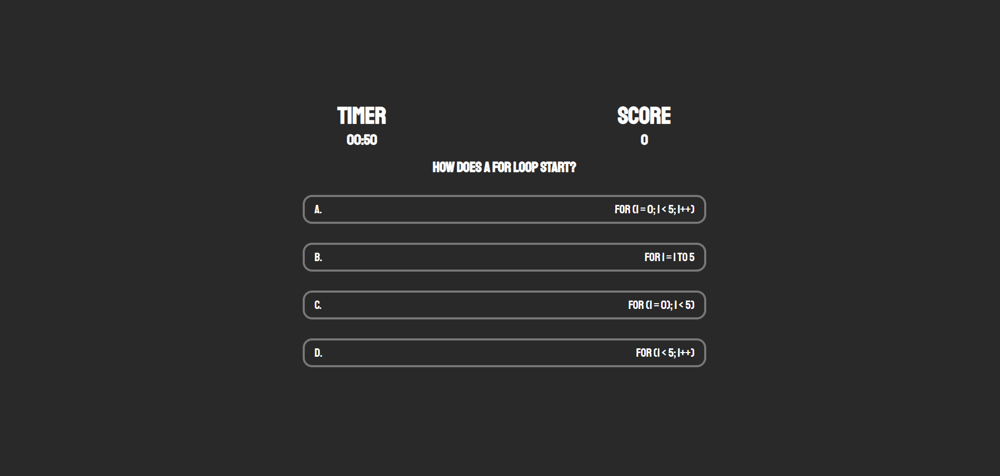

# Code Quiz

  
## Description

A webpage presenting a timed quiz on JavaScript fundamentals. Highscores are saved to local storage and can be viewed on the homepage leaderboard.

[Deployment](https://realnifty.github.io/code-quiz/)

## Table of Contents

- [Technologies](#technologies)
- [Installation](#installation)
- [License](#license)
- [Contributing](#contributing)
- [Tests](#tests)
- [Questions](#questions)

## Technologies

This app was built with:
- HTML
- CSS
- JavaScript

## Installation

No installation required! Simply navigate to the deployment via link provided above. To run locally, clone the repository to your local machine and open with your preferred browser.

## License
    
Licensed under the [MIT License](https://spdx.org/licenses/MIT.html)

## Contributing

No contributions will be accepted at this time.

## Tests

No testing is planned for this project at this time.

## Questions

Have questions? Reach me at the following sources!

* GitHub: [realnifty](https://github.com/realnifty)
* E-mail: rogelioalbertopedraza@gmail.com or lovecore@pm.me

